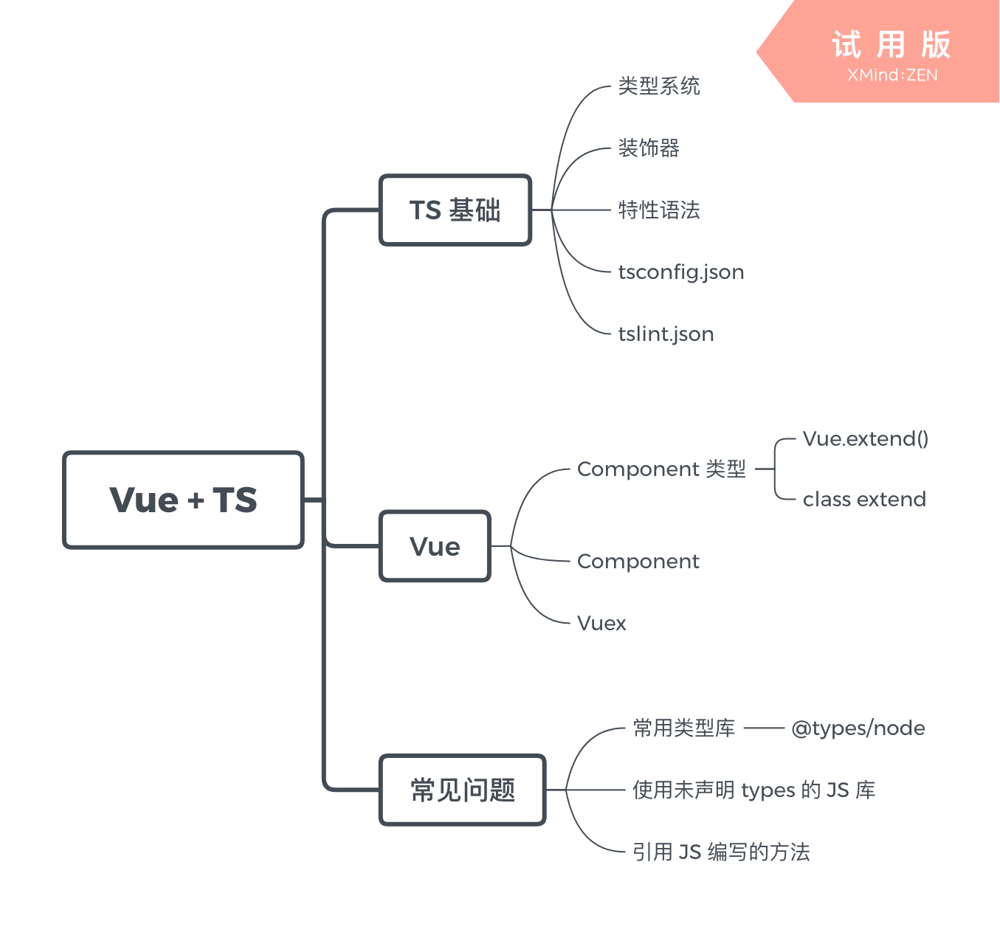

# Vue TypeScript Handbook

Let's develop Vue app with TypeScript.

[文档](https://zh-rocco.github.io/vue-typescript-handbook/)

## 大纲



## 写作

```bash
yarn

yarn dev
```

## 发布

```bash
git push
```

## License

MIT © [zh-rocco](https://github.com/zh-rocco)
