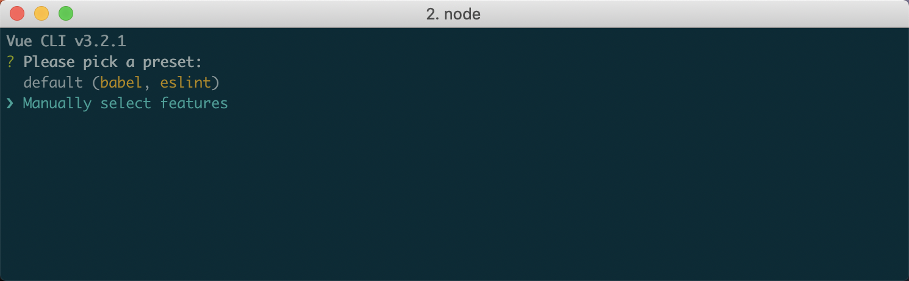
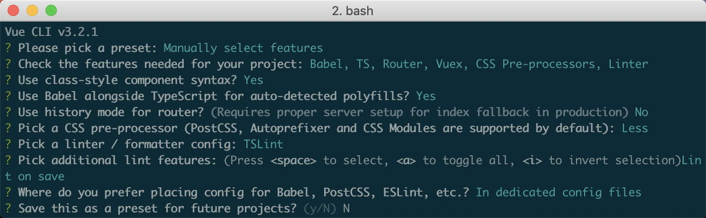

# 项目初始化

## 安装脚手架

```bash
yarn global add @vue/cli

// OR

npm i -g @vue/cli
```

## 创建项目

```bash
vue create vue-typescript
```

### 选择自定义 features



### features 配置如下

::: tip
`Use class-style component syntax?` 选择 `Yes`。
:::



## 与 JS 项目对比


## 是否使用 class-style component syntax

### 不使用

`src/views/Home.vue`

```vue
<template>
  <div class="home">
    
    <HelloWorld msg="Welcome to Your Vue.js + TypeScript App" />
  </div>
</template>

<script lang="ts">
import Vue from "vue";
import HelloWorld from "@/components/HelloWorld.vue"; // @ is an alias to /src

export default Vue.extend({
  name: "home",
  components: {
    HelloWorld,
  },
});
</script>
```

### 使用（推荐）

`src/views/Home.vue`

```vue{8-18}
<template>
  <div class="home">
    
    <HelloWorld msg="Welcome to Your Vue.js + TypeScript App" />
  </div>
</template>

<script lang="ts">
import { Component, Vue } from "vue-property-decorator";
import HelloWorld from "@/components/HelloWorld.vue"; // @ is an alias to /src

@Component({
  components: {
    HelloWorld,
  },
})
export default class Home extends Vue {}
</script>
```
